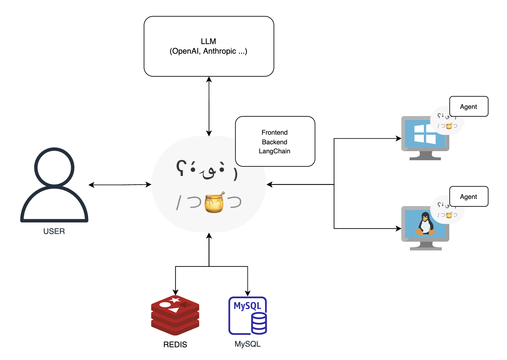

## 개요

`NerdyOps`는 Agent가 설치 된 원격지 시스템을 웹 기반 서버를 통해 모니터링 및 제어하는 운영 플랫폼입니다.
일반적인 모니터링 및 자동화 도구화 달리 LLM과 LangChain을 활용하여 AI에 기반한 자동화를 구현합니다.

## 아키텍처




## 기능


1. 원격 시스템 제어
    - 사용자의 작업 요청을 자연어로 입력받아 Agent가 설치 된 원격지 시스템에서 실행할 스크립트를 LLM과 LangChain을 통해 생성합니다.
    - 생성한 스크립트를 Agent가 받아 실행하고 실행 결과를 서버로 보고합니다.
    - 사용자가 요청한 작업 내용, 생성 스크립트, 결과를 LLM과 LangChain을 통해 해석하여 이해하기 쉬운 자연어로 사용자에게 제공합니다.
    - 여러 에이전트에 대한 병렬 작업을 지원합니다.
2. 원격 시스템 모니터링
    - CPU, MEM 사용량과 에이전트 실행 시간을 에이전트가 수집하여 서버로 전송합니다.
    - 클라우드 기반 VM의 경우 IMDS Metadata를 수집하여 서버로 전송합니다.
    - 옵션 설정을 통해 실행중인 프로세스, Listen Port 등을 추가로 모니터링 할 수 있습니다.
3. 모니터링 알림 메시지 수신 및 자체 검증 Webhook 제공
    - Grafana Alert Message, Prometheus Alert Manager 등 모니터링 플랫폼 트리거에 의해 알림을 수신하는 Webhook을 제공합니다.
    - 수신받은 알림 메시지에 에이전트를 구분할 수 있는 Hostname, PrivateIP등이 포함되어있으면 서버에서 자체적으로 등록된 Agent를 토대로 조회를 하고 알림 메시지 현상을 서버에서 직접 확인할 수 있게 스크립트를 생성해서 검증합니다.
    - 검증한 내용은 Slack 연동 기능을 통해 메시지로 제공합니다.
4. AI 활용 도구
    - LLM과 LangChain을 활용한 도구들을 제공합니다.
        - stackoverflow 기반 RAG 챗봇(개발중)
        - GitHub 저장소 비교 요약(개발중)
        - 번역기(초기 구현 완료)

## 프로젝트 구조


### /(root)

- `DEPENDENCIES.md`: 프로젝트의 종속성에 대한 정보를 포함한 파일입니다.
- `LICENSE`: 프로젝트의 라이선스 정보를 포함한 파일입니다.
- `README.md`: 프로젝트에 대한 전반적인 설명과 사용 방법을 제공하는 파일입니다.

### /agent

`agent` 디렉토리는 에이전트와 관련된 파일들을 포함하고 있습니다.

- `agent_config.json`: 에이전트 설정 파일입니다.
- `build.sh`: 빌드 스크립트입니다.
- `go.mod` 및 `go.sum`: Go 모듈 설정 파일들입니다.
- `logo`: 로고 관련 코드
    - `logo.go`: 로고 표시 기능을 구현한 파일입니다.
- `main.go`: 메인 에이전트 코드입니다.
- `monitoring`: 모니터링 관련 코드
    - `monitoring.go`: 모니터링 기능을 구현한 파일입니다.
- `pat`: PAT(Personal Access Token) 관련 코드
    - `pat.go`: PAT 기능을 구현한 파일입니다.

### /backend

`backend` 디렉토리는 백엔드(서버) 관련 파일들을 포함하고 있습니다.

- `app.py`: 백엔드 애플리케이션의 메인 파일입니다.
- `downloads`: 다양한 운영 체제용 에이전트 다운로드 파일을 포함하고 있습니다.
- `endpoints`: API 엔드포인트 관련 코드
    - `__init__.py`
    - `agent.py`: 에이전트 관련 엔드포인트
    - `auth.py`: 인증 관련 엔드포인트
    - `config.py`: 설정 관련 엔드포인트
    - `monitoring.py`: 모니터링 관련 엔드포인트
    - `pat.py`: PAT 관련 엔드포인트
    - `tasks.py`: 작업 관련 엔드포인트
    - `tools.py`: 도구 관련 엔드포인트
- `requirements.txt`: 백엔드 프로젝트의 종속성 파일입니다.
- `scheduler.py`: 스케줄러 코드입니다.
- `uploads`: 업로드된 파일들을 포함하고 있습니다.
- `utils`: 유틸리티 모듈
    - `db.py`: 데이터베이스 관련 유틸리티
    - `langchain_integration.py`: LangChain 통합 관련 유틸리티
    - `logo.py`: 로고 관련 유틸리티
    - `parser_file_text.py`: 파일 텍스트 파서 유틸리티
    - `redis_connection.py`: Redis 연결 유틸리티
    - `slack_integration.py`: Slack 통합 유틸리티
- `wsgi.py`: WSGI 애플리케이션 파일입니다.

### /frontend

`frontend` 디렉토리는 프론트엔드 관련 파일들을 포함하고 있습니다.

- `LICENSE`: 프론트엔드 프로젝트의 라이선스 파일입니다.
- `next-env.d.ts`, `next.config.mjs`: Next.js 설정 파일들입니다.
- `out`: 빌드된 정적 파일들을 포함하고 있습니다.
- `package-lock.json`, `package.json`: Node.js 종속성 파일들입니다.
- `postcss.config.js`, `prettier.config.js`: 스타일링 및 코드 포맷 설정 파일들입니다.
- `public`: 공개 자산을 포함하고 있습니다.
    - `images`: 이미지 파일들 (예: favicon.ico, nerdynot-circle.png)
- `src`: 소스 코드 디렉토리
    - `components`: 컴포넌트 디렉토리
        - `AgentList`: 에이전트 목록 컴포넌트
        - `AsideMenu`: 사이드 메뉴 컴포넌트
        - `Button`: 버튼 컴포넌트
        - `CardBox`: 카드 박스 컴포넌트
        - `ChartLineSample`: 라인 차트 샘플 컴포넌트
        - `Divider`: 구분선 컴포넌트
        - `FooterBar`: 하단 바 컴포넌트
        - `Form`: 폼 컴포넌트
        - `Icon`: 아이콘 컴포넌트
        - `Imds`: IMDS 관련 컴포넌트
        - `JustboilLogo`: Justboil 로고 컴포넌트
        - `Modal`: 모달 컴포넌트
        - `NavBar`: 네비게이션 바 컴포넌트
        - `NotificationBar`: 알림 바 컴포넌트
        - `NumberDynamic`: 동적 숫자 컴포넌트
        - `OverlayLayer`: 오버레이 레이어 컴포넌트
        - `PillTag`: 필 태그 컴포넌트
        - `Section`: 섹션 컴포넌트
        - `SettingsModal`: 설정 모달 컴포넌트
        - `Table`: 테이블 컴포넌트
        - `TaskSubmitModal`: 작업 제출 모달 컴포넌트
        - `UserAvatar`: 사용자 아바타 컴포넌트
    - `css`: CSS 스타일 파일들
    - `hooks`: 커스텀 훅 모음
    - `interfaces`: TypeScript 인터페이스 파일들
    - `layouts`: 레이아웃 컴포넌트들
    - `pages`: 페이지 컴포넌트들
    - `stores`: 상태 관리 관련 파일들
    - `utils`: 유틸리티 함수들

### /infra

`infra` 디렉토리는 빌드 및 배포를 위한 파일을 포함합니다.

- `Dockerfile`: Docker 이미지 설정 파일입니다.
- `docker-compose.yaml`: Docker Compose 설정 파일입니다.
- `nerdyops-helm`: Helm 차트 파일들
    - `Chart.yaml`: Helm 차트 설정 파일입니다.
    - `templates`: 템플릿 파일들
    - `values.yaml`: 차트 값 설정 파일입니다.
- `nginx.conf`: Nginx 설정 파일입니다.
- `supervisord.conf`: Supervisor 설정 파일입니다.

## 빠른 시작


`NerdyOps`를 빠르게 시작하려면 아래의 단계를 따라주세요. 이 가이드에서는 기본적인 설치 및 설정 절차를 설명합니다.

### 사전 요구 사항

- [Docker](https://www.docker.com/get-started)
- [Docker Compose](https://docs.docker.com/compose/install/)
- [Helm](https://helm.sh/docs/intro/install/)
- 인터넷 연결

### 1. 저장소 클론

먼저, GitHub에서 `NerdyOps` 저장소를 클론합니다.

```bash
git clone <https://github.com/NerdyNot/NerdyOps.git>
cd NerdyOps

```

### 2. Docker Compose로 서비스 시작

`Docker Compose`를 사용하여 모든 서비스를 시작합니다.

```bash
cd infra
docker-compose up -d --build
```

이 명령은 백엔드, 프론트엔드, 에이전트 등의 서비스를 Docker 컨테이너로 실행합니다.

### 3. Helm 차트로 Kubernetes 배포 (옵션)

Kubernetes 클러스터에 `NerdyOps`를 배포하려면 Helm을 사용합니다.

```bash
cd infra/nerdyops-helm
helm install nerdyops .

```

### 4. 에이전트 설정 및 배포

에이전트를 원격 시스템에 배포하고 설정합니다. 빌드의 경우 `agent/build.sh` 를 참고하세요.

```bash
cd agent
go mod tidy
go run main.go
```

### 5. 기본 설정

웹 브라우저에서 `NerdyOps` 웹 인터페이스에 접속합니다. 기본적으로 `http://localhost`에서 서비스가 제공됩니다.

초기 설정을 위해 다음을 참고하세요.

1. **관리자 계정 로그인 : `admin` / `admin`**
2. PAT 발급 : MyPAT 페이지에서 PAT 키를 발급 받습니다.
3. **에이전트 등록:** 원격 시스템에 배포된 에이전트를 실행하여 서버(기본값 : `http://localhost/api`)로 등록 후 발급 한 PAT 키를 통해 인증합니다.

### 6. 기능 활용

이제 `NerdyOps`의 주요 기능을 활용할 수 있습니다.

- **원격 시스템 제어:** 자연어로 작업을 요청하고, AI가 생성한 스크립트를 실행합니다.
- **원격 시스템 모니터링:** 실시간으로 시스템 상태를 모니터링합니다.
- **알림 메시지 수신 및 검증:** Webhook을 통해 모니터링 알림을 수신하고, 문제를 자동으로 검증합니다.
- **AI 도구 사용:** 번역기, GitHub 저장소 비교 요약 등 다양한 AI 도구를 활용합니다.

## 기여


개선 사항이나 버그 수정을 위한 이슈를 열거나 풀 리퀘스트를 제출해 주세요.

## 라이센스


이 프로젝트는 MIT 라이센스를 따릅니다. 자세한 내용은 [LICENSE](LICENSE.md) 파일을 참조하십시오.

## 의존성 라이브러리 리스트


의존성 파일에 대한 정보는 [DEPENDENCIES](DEPENDENCIES.md) 파일을 참조하십시오.

## Overview


`NerdyOps` is an operations platform for monitoring and controlling remote systems with an installed agent through a web-based server.

Unlike general monitoring and automation tools, it implements AI-based automation using LLM and LangChain.

## Architecture


## Features


1. Remote System Control
    - Accepts user task requests in natural language and generates scripts to be executed on remote systems with installed agents using LLM and LangChain.
    - The generated script is executed by the agent, and the execution result is reported to the server.
    - The task content, generated script, and results are interpreted and provided to the user in easy-to-understand natural language through LLM and LangChain.
    - Supports parallel operations across multiple agents.
2. Remote System Monitoring
    - Agents collect CPU and MEM usage and execution time data and send it to the server.
    - For cloud-based VMs, IMDS metadata is collected and sent to the server.
    - Optional settings allow additional monitoring of running processes, listening ports, etc.
3. Monitoring Alert Message Reception and Self-Verification Webhook
    - Provides a webhook to receive alerts triggered by monitoring platforms like Grafana Alert Message and Prometheus Alert Manager.
    - If the received alert message includes identifiable information such as hostname or private IP, the server uses the registered agent information to verify the alert message directly.
    - The verification details are provided as a message through Slack integration.
4. AI Tools
    - Provides tools utilizing LLM and LangChain.
        - Stackoverflow-based RAG chatbot (under development)
        - GitHub repository comparison summary (under development)
        - Translator (initial implementation completed)

## Project Structure


### /(root)

- `DEPENDENCIES.md`: Contains information about the project's dependencies.
- `LICENSE`: Contains the project's license information.
- `README.md`: Provides an overall description and usage instructions for the project.

### /agent

The `agent` directory contains files related to the agent.

- `agent_config.json`: Agent configuration file.
- `build.sh`: Build script.
- `go.mod` and `go.sum`: Go module configuration files.
- `logo`: Logo-related code
    - `logo.go`: Implements the logo display functionality.
- `main.go`: Main agent code.
- `monitoring`: Monitoring-related code
    - `monitoring.go`: Implements monitoring functionality.
- `pat`: PAT (Personal Access Token) related code
    - `pat.go`: Implements PAT functionality.

### /backend

The `backend` directory contains files related to the backend (server).

- `app.py`: Main file of the backend application.
- `downloads`: Contains agent download files for various operating systems.
- `endpoints`: API endpoint-related code
    - `__init__.py`
    - `agent.py`: Agent-related endpoints
    - `auth.py`: Authentication-related endpoints
    - `config.py`: Configuration-related endpoints
    - `monitoring.py`: Monitoring-related endpoints
    - `pat.py`: PAT-related endpoints
    - `tasks.py`: Task-related endpoints
    - `tools.py`: Tools-related endpoints
- `requirements.txt`: Dependency file for the backend project.
- `scheduler.py`: Scheduler code.
- `uploads`: Contains uploaded files.
- `utils`: Utility modules
    - `db.py`: Database-related utilities
    - `langchain_integration.py`: LangChain integration utilities
    - `logo.py`: Logo-related utilities
    - `parser_file_text.py`: File text parser utilities
    - `redis_connection.py`: Redis connection utilities
    - `slack_integration.py`: Slack integration utilities
- `wsgi.py`: WSGI application file.

### /frontend

The `frontend` directory contains files related to the frontend.

- `LICENSE`: License file for the frontend project.
- `next-env.d.ts`, `next.config.mjs`: Next.js configuration files.
- `out`: Contains built static files.
- `package-lock.json`, `package.json`: Node.js dependency files.
- `postcss.config.js`, `prettier.config.js`: Styling and code formatting configuration files.
- `public`: Contains public assets.
    - `images`: Image files (e.g., favicon.ico, nerdynot-circle.png)
- `src`: Source code directory
    - `components`: Components directory
        - `AgentList`: Agent list component
        - `AsideMenu`: Side menu component
        - `Button`: Button component
        - `CardBox`: Card box component
        - `ChartLineSample`: Line chart sample component
        - `Divider`: Divider component
        - `FooterBar`: Footer bar component
        - `Form`: Form component
        - `Icon`: Icon component
        - `Imds`: IMDS related component
        - `JustboilLogo`: Justboil logo component
        - `Modal`: Modal component
        - `NavBar`: Navigation bar component
        - `NotificationBar`: Notification bar component
        - `NumberDynamic`: Dynamic number component
        - `OverlayLayer`: Overlay layer component
        - `PillTag`: Pill tag component
        - `Section`: Section component
        - `SettingsModal`: Settings modal component
        - `Table`: Table component
        - `TaskSubmitModal`: Task submission modal component
        - `UserAvatar`: User avatar component
    - `css`: CSS style files
    - `hooks`: Custom hooks collection
    - `interfaces`: TypeScript interface files
    - `layouts`: Layout components
    - `pages`: Page components
    - `stores`: State management files
    - `utils`: Utility functions

### /infra

The `infra` directory contains files for building and deployment.

- `Dockerfile`: Docker image configuration file.
- `docker-compose.yaml`: Docker Compose configuration file.
- `nerdyops-helm`: Helm chart files
    - `Chart.yaml`: Helm chart configuration file.
    - `templates`: Template files
    - `values.yaml`: Chart values configuration file.
- `nginx.conf`: Nginx configuration file.
- `supervisord.conf`: Supervisor configuration file.

## Quick Start


Follow these steps for a quick start with `NerdyOps`. This guide covers the basic installation and setup process.

### Prerequisites

- [Docker](https://www.docker.com/get-started)
- [Docker Compose](https://docs.docker.com/compose/install/)
- [Helm](https://helm.sh/docs/intro/install/)
- Internet connection

### 1. Clone the Repository

First, clone the `NerdyOps` repository from GitHub.

```bash
git clone <https://github.com/NerdyNot/NerdyOps.git>
cd NerdyOps

```

### 2. Start Services with Docker Compose

Use `Docker Compose` to start all services.

```bash
cd infra
docker-compose up -d --build
```

This command runs the backend, frontend, and agents as Docker containers.

### 3. Deploy with Helm Charts on Kubernetes (Optional)

To deploy `NerdyOps` on a Kubernetes cluster, use Helm.

```bash
cd infra/nerdyops-helm
helm install nerdyops .
```

### 4. Set Up and Deploy Agents

Deploy and configure agents on remote systems. Refer to `agent/build.sh` for building instructions.

```bash
cd agent
go mod tidy
go run main.go
```

### 5. Initial Setup

Access the `NerdyOps` web interface via a web browser. By default, the service is available at `http://localhost`.

Refer to the following for the initial setup:

1. **Admin Account Login: `admin` / `admin`**
2. **PAT Issuance: Issue a PAT key on the MyPAT page.**
3. **Agent Registration:** Register the deployed agent on the server (default: `http://localhost/api`) and authenticate using the issued PAT key.

### 6. Utilize Features

You can now utilize the main features of `NerdyOps`.

- **Remote System Control:** Request tasks in natural language and execute scripts generated by AI.
- **Remote System Monitoring:** Monitor system status in real-time.
- **Receive and Verify Alert Messages:** Receive alerts via webhook and automatically verify issues.
- **Use AI Tools:** Utilize various AI tools, such as the translator and GitHub repository comparison summary.

## Contribution


Please open an issue or submit a pull request for any improvements or bug fixes.

## License


This project is licensed under the MIT License. See the [LICENSE](LICENSE.md) file for details.

## Dependency Library List


For information about dependency files, refer to the [DEPENDENCIES](DEPENDENCIES.md) file.